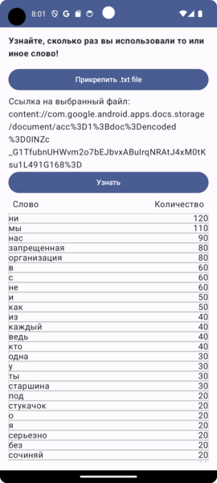

# Android application to get information about the number of occurrences of words in a text

## An url.txt file is submitted for input. At the output, we get a table with the results

Page of application:

[Project Backend](https://github.com/MarinaSenoshenko/WordNumberCounter/tree/main/backend)

## Technologies Used
* Kotlin
* Gradle
* Android Compose
